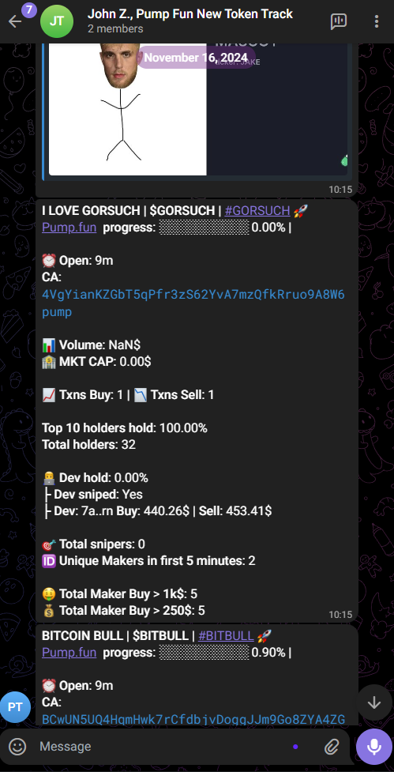

# Pump.fun New Token Track Telegram Bot (Pump.fun)
## Main Features

- Track All tokens, All Pools on Pump.fun 
- Provide the detailed insights about new token

## Screenshot



## Tech stack
- Telegram API
- Solana/web3
- Pump.fun
- bitQuery

## Prerequisites

Before you begin, ensure you have met the following requirements:

- Node.js installed (v18 or above recommended)
- Telegram bot token from bot father

## Configurations

1. Clone the repository:

```sh
git clone https://github.com/crypto-artisan/pump.fun-token-track.git
```

2. Go to the project directory:

```sh
cd pump.fun-token-track
```

3. Install the dependencies:

```sh
npm install
```

4. Create a new `.env` file and add your Private key, Rpc URL

`.env` file
```sh
TELEGRAM_TOKEN=
CHANNEL_ID=
BITQUERY_API_KEY=
BITQUERY_AUTH_TOKEN=
POLLING_TIME=
MODE=

```

5. Then run the bot

```sh
npm run start
```

## Version 1.0,   21/6/2024

## Contact me
- [Telegram](https://t.me/JohnDAT0218)

- [Github](https://github.com/crypto-artisan)